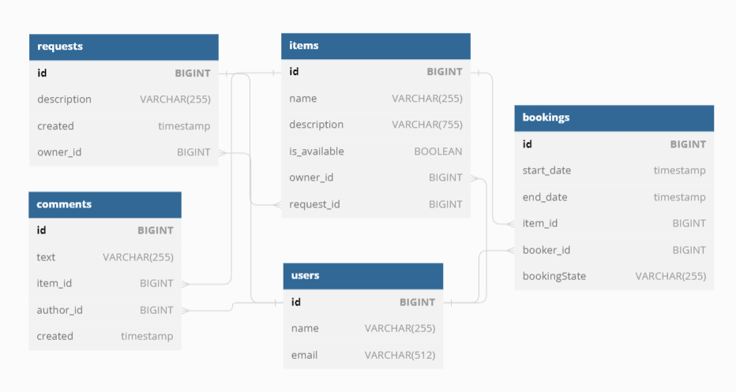

# Shareit
Технологии: Java + Spring Boot + Docker + PostgreSQL + Hibernate + Maven + JUnit5 + Mockito + RESTful API + MapStruct + Lombok

---

Сервис решает проблему связанную с необходимостью приобретения вещей для временного использования. Вместо того, чтобы покупать новую вещь, пользователи могут найти ее на сервисе и взять в аренду на определенное время. Это позволяет экономить деньги и ресурсы, а также уменьшает нагрузку на окружающую среду.

Функционал сервиса позволяет бронировать вещь на определенные даты и закрывает к ней доступ на время бронирования от других желающих. Если нужной вещи на сервисе нет, пользователи могут оставлять запросы, по которым можно добавлять новые вещи для шеринга. Это обеспечивает удобство и гибкость для пользователей и помогает им находить нужные вещи для временного использования. Так же реализована возможность оставлять отзывы после того как пользователь воспользовался вещью.

## Микросервисная архитектура
Приложение состоит из 2 основных модулей:

- Gateway. Принимает запросы от пользователей. Распределяет нагрузку, выполняет первичную проверку и направляет запросы дальше в основной сервис
- Main service. Серверная часть приложения. Получает запросы, выполняет операции, отправляет данные клиенту
 ---
## Эндпоинты
### Bookings

- POST /bookings/ - добавляет запрос на бронирование вещи.
- PATCH /bookings/{bookingId} - обновляет статус бронирования. Подтверждение или отклонение запроса на бронирование.
- GET /bookings/{bookingId} - получение данных о конкретном бронировании (включая его статус).
- GET /bookings?state={state} получение списка всех бронирований текущего пользователя.
- GET /bookings/owner?state={state} - получение списка бронирований для всех вещей текущего пользователя.

---

### Items

- GET /items/{id} - получать данные вещи по идентификатору
- GET /items/ - получать данные всех вещей
- POST /items/ - добавление вещи
- PATCH /items/{id} - обновление вещи по id
- DELETE /items/{id} - удаление вещи по id
- POST /items/{itemId}/comment - добавление отзывов на вещь после того, как взяли её в аренду

---

### Request

- POST /requests - добавить новый запрос вещи. Основная часть запроса — текст запроса, где пользователь описывает, какая именно вещь ему нужна
- GET /requests — получить список своих запросов вместе с данными об ответах на них.
- GET /requests/all?from={from}&size={size} — получить список запросов, созданных другими пользователями.
- GET/requests/{requestId} — получить данные об одном конкретном запросе вместе с данными об ответах на него в том же формате,

---

### User

- GET /users/{id} - получать пользователя по идентификатору
- GET /users/ - получать всех пользователей
- POST /users/ - добавлять пользователя в память
- PATCH /users/{id} - обновление пользователя по id
- DELETE /users/{id} - удаление пользователя по id

---
### Схема базы данных:

